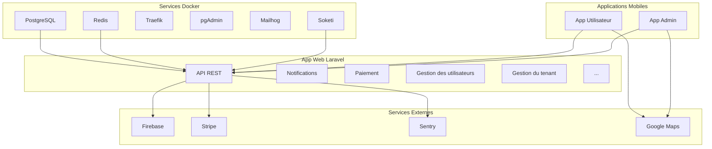

# Guide de Démarrage Rapide

Ce guide vous accompagne pour mettre en fonctionnement l'ensemble du projet Le Coursier, de l'infrastructure aux applications mobiles.

## Qu'est-ce que Le Coursier ?

Le Coursier est un **écosystème complet de livraison** composé de plusieurs éléments qui fonctionnent ensemble :

### 🏗️ Infrastructure

- **Services Docker** : Base de données, cache, reverse proxy
- **Backend Laravel** : API et logique métier
- **Services tiers** : Firebase, Stripe, Sentry

### 📱 Applications

- **App Web** : Pour les administrateurs (Getsion des utilisateurs, tenant, paiement,...)
- **App Admin/Coursier** : Pour la gestion et la livraison

### 🔄 Intégrations

- **Notifications** : Firebase Cloud Messaging
- **Paiements** : Stripe (abonnements et paiements)
- **Monitoring** : Sentry (erreurs et performances)
- **Temps réel** : WebSockets via Soketi

## Vue d'ensemble du déploiement



## Étapes de mise en fonctionnement

### Phase 1 : Préparation des services externes

#### 1️⃣ Création des comptes

Créez vos comptes sur les services suivants :

- **[Firebase](https://console.firebase.google.com/)**

  - ✅ Créer un projet
  - ✅ Activer Cloud Messaging (FCM)
  - ✅ Télécharger les fichiers de configuration

- **[Stripe](https://stripe.com)**

  - ✅ Créer un compte
  - ✅ Configurer un produit
  - ✅ Créer les prix d'abonnement (mensuel/annuel)

- **[Sentry](https://sentry.io)**

  - ✅ Créer une organisation
  - ✅ Créer les projets (Laravel + Mobile)

- **[Google Cloud](https://console.cloud.google.com/)**
  - ✅ Activer Google Maps API
  - ✅ Créer une clé API

#### 2️⃣ Configuration des services

Suivez les guides détaillés :

- [Configuration Firebase](../pre-requisites/firebase)
- [Configuration Stripe](../pre-requisites/stripe)
- [Configuration Sentry](../pre-requisites/sentry)

### Phase 2 : Infrastructure Docker

#### 1️⃣ Installation des services

```bash
# Cloner le dépôt des services
git clone <depot-pfe-services>
cd PFE-SERVICES

# Créer les réseaux Docker
docker network create lecoursier
docker network create traefik-public

# Démarrer les services
docker-compose up -d
```

#### 2️⃣ Vérification des services

Vérifiez que les services sont accessibles :

- **pgAdmin** : https://pgadmin.josemokeni.cloud
- **Redis Commander** : https://redis.josemokeni.cloud
- **Mailhog** : https://mailhog.josemokeni.cloud

:::tip Services disponibles
Les services PostgreSQL et Redis sont accessibles uniquement via le réseau Docker `lecoursier` pour la sécurité.
:::

### Phase 3 : Backend Laravel

#### 1️⃣ Installation et configuration

```bash
# Cloner le dépôt Laravel
git clone <depot-laravel>
cd lecoursier-laravel

# Configuration des variables d'environnement
cp .env.example .env
# Remplir le fichier .env avec vos valeurs

# Placer le fichier Firebase
mkdir -p storage/app/json
cp votre-service-account.json storage/app/json/service-account.json
```

#### 2️⃣ Démarrage de l'application

```bash
# Démarrer les conteneurs
docker compose up -d

# Configuration initiale
docker compose exec app chmod 664 .env
docker compose exec app php artisan key:generate
docker compose exec app php artisan migrate
docker compose exec app php artisan db:seed
```

#### 3️⃣ Vérification

L'application Laravel sera accessible selon votre configuration :

- **Local** : http://localhost
- **Production** : https://lecoursier.josemokeni.cloud

### Phase 4 : Applications mobiles

#### 1️⃣ Préparation des projets

```bash
# App Utilisateur
git clone <depot-app-user>
cd lecoursier-mobile-app-user
npm install
cp .env.example .env

# App Admin
git clone <depot-app-admin>
cd lecoursier-mobile-app
npm install
cp .env.example .env
```

#### 2️⃣ Configuration Firebase

Pour chaque application mobile :

1. **Placez les fichiers Firebase** dans le répertoire racine :

   - `google-services.json` (Android)
   - `GoogleService-Info.plist` (iOS)

2. **Générez les certificats SHA-1** :

   ```bash
   npx expo prebuild --clean
   cd android && ./gradlew signingReport
   ```

3. **Ajoutez le certificat** dans votre projet Firebase

#### 3️⃣ Configuration des variables

Configurez les fichiers `.env` de chaque app :

```bash
# Configuration API (adaptez l'URL selon votre environnement)
EXPO_PUBLIC_API_URL=http://10.0.2.2:80/api  # Émulateur Android
EXPO_PUBLIC_API_URL=http://localhost:80/api   # Simulateur iOS
EXPO_PUBLIC_API_URL=https://lecoursier.josemokeni.cloud/api  # Production

# Configuration Pusher
EXPO_PUBLIC_PUSHER_HOST=http://10.0.2.2
EXPO_PUBLIC_PUSHER_APP_KEY=votre_app_key
EXPO_PUBLIC_PUSHER_APP_SECRET=votre_app_secret
EXPO_PUBLIC_PUSHER_APP_ID=votre_app_id
EXPO_PUBLIC_PUSHER_APP_CLUSTER=mt1
EXPO_PUBLIC_PUSHER_PORT=6001

# Clé Google Maps
GOOGLE_MAPS_API_KEY=votre_cle_google_maps
```

#### 4️⃣ Lancement des applications

```bash
# Pour le développement avec Expo Go (fonctionnalités limitées)
npx expo start

# Pour tester toutes les fonctionnalités (recommandé)
npx expo run:android  # Android
npx expo run:ios      # iOS (macOS uniquement)
```

## Configuration par environnement

### Développement local

```bash
# Backend Laravel
EXPO_PUBLIC_API_URL=http://10.0.2.2:80    # Émulateur Android
EXPO_PUBLIC_API_URL=http://localhost:80    # Simulateur iOS

# Pusher
EXPO_PUBLIC_PUSHER_HOST=http://10.0.2.2

# Mode debug
APP_DEBUG=true
SENTRY_TRACES_SAMPLE_RATE=1.0
```

### Staging

```bash
# Backend Laravel
EXPO_PUBLIC_API_URL=https://lecoursier.staging.josemokeni.cloud

# Pusher
EXPO_PUBLIC_PUSHER_HOST=https://lecoursier.staging.josemokeni.cloud

# Configuration intermédiaire
APP_DEBUG=false
SENTRY_TRACES_SAMPLE_RATE=0.5
```

### Production

```bash
# Backend Laravel
EXPO_PUBLIC_API_URL=https://lecoursier.josemokeni.cloud

# Pusher
EXPO_PUBLIC_PUSHER_HOST=https://lecoursier.josemokeni.cloud

# Configuration optimisée
APP_DEBUG=false
SENTRY_TRACES_SAMPLE_RATE=0.1
```

## Points de contrôle

### ✅ Infrastructure opérationnelle

- [ ] Services Docker démarrés
- [ ] pgAdmin accessible
- [ ] Redis fonctionnel
- [ ] Réseaux Docker créés

### ✅ Backend opérationnel

- [ ] Laravel accessible
- [ ] Base de données migrée
- [ ] Variables d'environnement configurées
- [ ] Fichier Firebase en place

### ✅ Services externes connectés

- [ ] Firebase : notifications push fonctionnelles
- [ ] Stripe : webhooks configurés
- [ ] Sentry : monitoring actif
- [ ] Google Maps : clé API valide

### ✅ Applications mobiles fonctionnelles

- [ ] Compilation sans erreur
- [ ] Connexion à l'API
- [ ] Notifications push reçues
- [ ] Géolocalisation active
- [ ] Paiements fonctionnels

## Dépannage rapide

### Problème : Applications mobiles ne se connectent pas à l'API

**Solutions :**

1. **Vérifiez l'URL de l'API** dans les variables d'environnement
2. **Testez l'API** avec un navigateur ou Postman
3. **Vérifiez les réseaux Docker** (pour le développement local)
4. **Contrôlez les logs Laravel** : `docker compose logs app`

### Problème : Notifications push non reçues

**Solutions :**

1. **Vérifiez les fichiers Firebase** dans les apps mobiles
2. **Confirmez le certificat SHA-1** dans Firebase
3. **Testez sur un appareil physique** (pas l'émulateur)
4. **Vérifiez le fichier service-account.json** dans Laravel

### Problème : Paiements Stripe échouent

**Solutions :**

1. **Vérifiez les clés API Stripe** dans Laravel
2. **Testez les webhooks** avec Stripe CLI
3. **Contrôlez les logs Stripe** dans le dashboard
4. **Utilisez les cartes de test** appropriées

### Problème : Géolocalisation imprécise

**Solutions :**

1. **Vérifiez la clé Google Maps API**
2. **Activez la géolocalisation** haute précision
3. **Testez en extérieur** (signal GPS)
4. **Contrôlez les permissions** de localisation

## Ressources et support

### Documentation détaillée

- [Installation Laravel](../web-part/installation-laravel)
- [Installation Applications Mobiles](../mobile-apps/installation-mobile)
- [Guide d'utilisation](../mobile-apps/guide-utilisation)

### Liens utiles

- **Firebase Console** : https://console.firebase.google.com/
- **Stripe Dashboard** : https://dashboard.stripe.com/
- **Sentry** : https://sentry.io/
- **Google Cloud Console** : https://console.cloud.google.com/

### Contact

En cas de problème, consultez d'abord :

1. Cette documentation
2. Les logs des applications
3. Les tableaux de bord des services externes

:::tip Conseil pour débuter
Commencez par faire fonctionner l'infrastructure et la partie Web Laravel avant de configurer les applications mobiles. Cela facilite le débogage.
:::

:::warning Important
Assurez-vous que tous les services externes (Firebase, Stripe, Sentry) sont correctement configurés avant de tester l'ensemble du système.
:::
