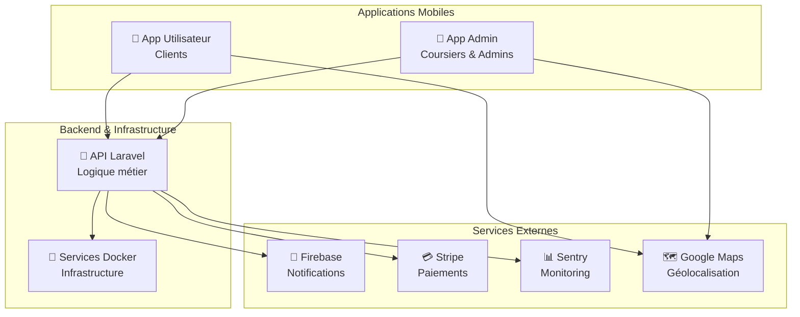

# Introduction au Projet Le Coursier

Bienvenue dans la documentation complète du projet **Le Coursier**, un écosystème de livraison moderne développé dans le cadre d'un projet de fin d'études.

## Qu'est-ce que Le Coursier ?

Le Coursier est une **plateforme complète de livraison** qui connecte clients, coursiers et administrateurs à travers un système intégré comprenant :

### 🎯 Vision du projet

Créer une solution de livraison moderne, scalable et facile à utiliser qui permet :

- Aux **clients** de commander des livraisons en quelques clics
- Aux **coursiers** de recevoir et gérer leurs missions efficacement
- Aux **administrateurs** de superviser l'ensemble des opérations

### 🏗️ Architecture du système

Le projet est composé de **plusieurs éléments interconnectés** qui forment un écosystème complet :

## Composants du projet

### 📱 Applications Mobiles (React Native/Expo)

**Application Utilisateur :**

- Interface intuitive pour passer des commandes
- Suivi en temps réel des livraisons
- Gestion des paiements et abonnements
- Historique et évaluations

**Application Admin/Coursier :**

- Dashboard de gestion pour les administrateurs
- Interface optimisée pour les coursiers
- Outils de reporting et d'analyse
- Gestion des affectations automatiques

### 🔧 Backend Laravel (API REST)

**Fonctionnalités principales :**

- API RESTful pour les applications mobiles
- Gestion des utilisateurs et authentification
- Traitement des commandes et affectations
- Intégration avec les services de paiement
- Notifications push et temps réel

### 🐳 Infrastructure Docker

**Services orchestrés :**

- **PostgreSQL** : Base de données principale
- **Redis** : Cache et gestion des sessions
- **Traefik** : Reverse proxy avec SSL automatique
- **Soketi** : WebSockets pour le temps réel
- **Services d'administration** : pgAdmin, Redis Commander, Mailhog

### 🔗 Intégrations Externes

**Services tiers critiques :**

- **Firebase** : Notifications push cross-platform
- **Stripe** : Traitement sécurisé des paiements
- **Sentry** : Monitoring et tracking des erreurs
- **Google Maps** : Géolocalisation et calcul d'itinéraires

## Avantages de cette architecture

### 🚀 Scalabilité

- Architecture microservices avec Docker
- Support multi-environnements (dev, staging, prod)
- Possibilité de scaling horizontal

### 🔒 Sécurité

- HTTPS obligatoire avec certificats automatiques
- Authentification robuste avec Laravel Sanctum
- Validation et chiffrement des données sensibles

### 📊 Monitoring

- Tracking des erreurs avec Sentry
- Logs centralisés et analytics
- Métriques de performance en temps réel

### 🔄 Maintenance

- Mises à jour automatiques avec Watchtower
- Configuration par variables d'environnement
- Tests automatisés et CI/CD

## Démarrage rapide

### Étapes principales

1. **🏗️ Infrastructure** : Déployer les services Docker
2. **🔧 Backend** : Configurer et lancer l'API Laravel
3. **📱 Mobile** : Configurer et tester les applications
4. **🔗 Intégrations** : Connecter les services externes

### Prérequis techniques

**Obligatoires :**

- **Docker** et **Docker Compose** : Infrastructure et services
- **Comptes services externes** : Firebase, Stripe, Sentry, Google Cloud

**Pour le développement mobile :**

- **Node.js** (v18+) et **npm** : Environnement React Native
- **Expo CLI** et **EAS CLI** : Outils de développement
- **Android Studio** et/ou **Xcode** : Développement natif

### Ordre de mise en fonctionnement

:::info Séquence recommandée

1. **Services pré-requis** → Configuration des comptes externes
2. **Infrastructure Docker** → Déploiement des services de base
3. **Backend Laravel** → Configuration et lancement de l'API
4. **Applications mobiles** → Installation et configuration
5. **Tests d'intégration** → Vérification du fonctionnement global
   :::

## Documentation structurée

Cette documentation est organisée pour vous guider étape par étape :

### 📖 Guides principaux

- **[Guide de démarrage rapide](./guide-demarrage-rapide)** : Mise en fonctionnement complète

### 🔧 Configuration des services

- **[Services Docker](./pre-requisites/services)** : Infrastructure de base
- **[Firebase](./pre-requisites/firebase)** : Notifications push
- **[Stripe](./pre-requisites/stripe)** : Paiements et abonnements
- **[Sentry](./pre-requisites/sentry)** : Monitoring et erreurs

### 🚀 Déploiement

- **[Installation Laravel](./web-part/installation-laravel)** : Backend API
- **[Applications mobiles](./mobile-apps/installation-mobile)** : Apps React Native
- **[Guide d'utilisation](./mobile-apps/guide-utilisation)** : Manuel utilisateur

:::tip Conseil de démarrage
Commencez par lire le **Guide de démarrage rapide** qui vous donnera une vue d'ensemble du processus complet, puis suivez les guides spécifiques selon vos besoins.
:::

:::warning Important
Tous les composants sont interdépendants. Assurez-vous de suivre l'ordre recommandé pour éviter les problèmes de configuration.
:::
