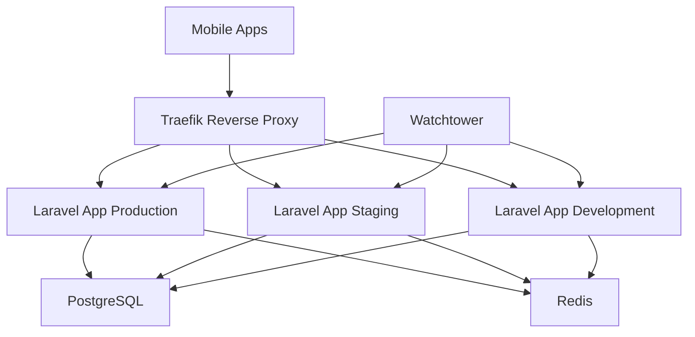

# Déploiement en Production

Cette section décrit le processus complet de déploiement du projet Le Coursier en production, incluant l'infrastructure, les applications et la configuration.

## Architecture de production

### Vue d'ensemble

Le projet Le Coursier utilise une architecture microservices avec Docker et supporte plusieurs environnements :

- **Production** : `lecoursier.josemokeni.cloud`
- **Staging** : `lecoursier.staging.josemokeni.cloud`
- **Development** : `lecoursier.develop.josemokeni.cloud`

### Infrastructure



## Prérequis de déploiement

### 1. Serveur VPS

#### Configuration minimale recommandée

- **CPU** : 2 vCPUs
- **RAM** : 4 GB
- **Stockage** : 50 GB SSD
- **OS** : Ubuntu 20.04 LTS ou supérieur

#### Logiciels requis

- Docker et Docker Compose
- Git
- UFW (firewall)

### 2. Domaines et DNS

Configurez vos enregistrements DNS pour pointer vers votre serveur :

```
lecoursier.josemokeni.cloud          A    VOTRE_IP_SERVEUR
lecoursier.staging.josemokeni.cloud  A    VOTRE_IP_SERVEUR
lecoursier.develop.josemokeni.cloud  A    VOTRE_IP_SERVEUR
pgadmin.josemokeni.cloud            A    VOTRE_IP_SERVEUR
redis.josemokeni.cloud              A    VOTRE_IP_SERVEUR
mailhog.josemokeni.cloud            A    VOTRE_IP_SERVEUR
```

## Configuration automatisée avec Ansible

### 1. Installation d'Ansible

```bash
# Ubuntu/Debian
sudo apt update
sudo apt install software-properties-common
sudo add-apt-repository --yes --update ppa:ansible/ansible
sudo apt install ansible

# macOS
brew install ansible

# Vérification
ansible --version
```

### 2. Configuration du playbook

```bash
# Cloner le repository du playbook
git clone <url-du-depot-playbook>
cd PFE-PLAYBOOK

# Configurer l'inventaire
cp inventory.ini.example inventory.ini
```

Modifier `inventory.ini` :

```ini
[vps]
production ansible_host=VOTRE_IP_SERVEUR ansible_user=root
```

### 3. Personnalisation des variables

Modifier `group_vars/all.yml` :

```yaml
# Configuration utilisateur
admin_username: "admin"
admin_password: "mot_de_passe_securise"

# Configuration Git
git_user_name: "Votre Nom"
git_user_email: "votre.email@example.com"
git_generate_ssh_key: true

# Configuration système
timezone: "Tunisie/Tunis"
hostname: "lecoursier-prod"
```

### 4. Exécution du playbook

```bash
# Exécution avec mot de passe SSH
ansible-playbook -i inventory.ini vps-setup.yml --ask-pass

# Ou avec clé SSH
ansible-playbook -i inventory.ini vps-setup.yml
```

Le playbook configure automatiquement :

- Mise à jour du système
- Installation de Docker et Docker Compose
- Configuration du firewall (UFW)
- Installation de fail2ban
- Configuration Git et génération de clés SSH
- Création d'un utilisateur admin

## Déploiement des services

### 1. Services d'infrastructure

```bash
# Cloner le repository des services
git clone <url-du-depot-services>
cd PFE-SERVICES

# Créer les réseaux Docker
docker network create lecoursier
docker network create traefik-public

# Configurer les domaines (optionnel pour domaines personnalisés)
# Modifier docker-compose.yaml avec vos domaines

# Démarrer les services
docker-compose up -d
```

### 2. Vérification des services

```bash
# Vérifier que tous les services sont en cours d'exécution
docker-compose ps

# Vérifier les logs
docker-compose logs traefik
docker-compose logs postgres
docker-compose logs redis
```

### 3. Accès aux services

- **pgAdmin** : https://pgadmin.josemokeni.cloud
- **Redis Commander** : https://redis.josemokeni.cloud
- **Mailhog** : https://mailhog.josemokeni.cloud

## Déploiement de l'application Laravel

### 1. Cloner le repository

```bash
git clone <url-du-depot-laravel>
cd PFE-PROD
```

### 2. Configuration des environnements

#### Créer les fichiers d'environnement

```bash
cp .env.example .env
cp .env.example .env.staging
cp .env.example .env.develop
```

#### Configuration .env (Production)

```bash
APP_NAME="Le Coursier"
APP_ENV=production
APP_KEY=
APP_DEBUG=false
APP_URL=https://lecoursier.josemokeni.cloud

# Base de données
DB_CONNECTION=pgsql
DB_HOST=postgres
DB_PORT=5432
DB_DATABASE=lecoursier_prod
DB_USERNAME=postgres
DB_PASSWORD=mot_de_passe_securise

# Cache et sessions
CACHE_DRIVER=redis
SESSION_DRIVER=redis
QUEUE_CONNECTION=redis
REDIS_HOST=redis

# Configuration Firebase
FIREBASE_PROJECT_ID=votre-projet-firebase-id

# Configuration Stripe
STRIPE_KEY=pk_live_votre_cle_publique_production
STRIPE_SECRET=sk_live_votre_cle_secrete_production
STRIPE_WEBHOOK_SECRET=whsec_votre_secret_webhook_production
STRIPE_PRODUCT_ID=prod_votre_id_produit
STRIPE_MONTHLY_PRICE_ID=price_votre_id_prix_mensuel
STRIPE_YEARLY_PRICE_ID=price_votre_id_prix_annuel

# Configuration Sentry
SENTRY_LARAVEL_DSN=https://votre-dsn-production@sentry.io/projet-id
SENTRY_TRACES_SAMPLE_RATE=0.1
SENTRY_PROFILES_SAMPLE_RATE=0.1
SENTRY_RELEASE=v1.0.0

# Configuration des emails
MAIL_MAILER=smtp
MAIL_HOST=votre-serveur-smtp
MAIL_PORT=587
MAIL_USERNAME=votre-username-smtp
MAIL_PASSWORD=votre-mot-de-passe-smtp
MAIL_ENCRYPTION=tls
MAIL_FROM_ADDRESS="noreply@lecoursier.app"
MAIL_FROM_NAME="${APP_NAME}"
```

#### Fichier service-account.json

```bash
# Créer le répertoire Firebase
mkdir -p docker/firebase

# Copier votre fichier service-account.json
cp /chemin/vers/service-account.json docker/firebase/service-account.json
```

### 3. Déploiement avec Docker Compose

```bash
# Démarrer tous les environnements
docker compose up -d

# Configurer les permissions
docker compose exec app chmod 644 .env
docker compose exec app-staging chmod 644 .env.staging
docker compose exec app-develop chmod 644 .env.develop

# Générer les clés d'application
docker compose exec app php artisan key:generate
docker compose exec app-staging php artisan key:generate
docker compose exec app-develop php artisan key:generate

# Exécuter les migrations
docker compose exec app php artisan migrate
docker compose exec app-staging php artisan migrate
docker compose exec app-develop php artisan migrate

# Mettre en cache les configurations (production)
docker compose exec app php artisan config:cache
docker compose exec app php artisan route:cache
docker compose exec app php artisan view:cache
```

## Builds et déploiement des applications mobiles

### 1. Configuration EAS

#### Installation et configuration

```bash
# Installation d'EAS CLI
npm install -g eas-cli

# Connexion à Expo
eas login

# Configuration pour chaque application
cd lecoursier-mobile-app-user
eas build:configure

cd ../lecoursier-mobile-app
eas build:configure
```

#### Configuration eas.json

```json
{
  "cli": {
    "version": ">= 3.0.0"
  },
  "build": {
    "development": {
      "developmentClient": true,
      "distribution": "internal",
      "env": {
        "EXPO_PUBLIC_API_URL": "https://lecoursier.develop.josemokeni.cloud"
      }
    },
    "preview": {
      "distribution": "internal",
      "env": {
        "EXPO_PUBLIC_API_URL": "https://lecoursier.staging.josemokeni.cloud"
      }
    },
    "production": {
      "env": {
        "EXPO_PUBLIC_API_URL": "https://lecoursier.josemokeni.cloud"
      }
    }
  },
  "submit": {
    "production": {}
  }
}
```

### 2. Builds de production

#### Application Utilisateur

```bash
cd lecoursier-mobile-app-user

# Build Android pour Google Play Store
eas build --platform android --profile production

# Build iOS pour App Store
eas build --platform ios --profile production
```

#### Application Admin

```bash
cd lecoursier-mobile-app

# Build Android
eas build --platform android --profile production

# Build iOS
eas build --platform ios --profile production
```

### 3. Soumission aux stores

```bash
# Google Play Store
eas submit --platform android

# App Store
eas submit --platform ios
```

## Configuration SSL et sécurité

### 1. Certificats SSL automatiques

Traefik gère automatiquement les certificats SSL via Let's Encrypt. Assurez-vous que :

- Les domaines pointent vers votre serveur
- Les ports 80 et 443 sont ouverts
- Le fichier `acme.json` a les bonnes permissions

```bash
# Vérifier les permissions
chmod 600 docker/traefik/acme.json

# Vérifier les certificats
docker compose logs traefik | grep -i certificate
```

### 2. Configuration du firewall

```bash
# Configurer UFW
sudo ufw allow ssh
sudo ufw allow 80
sudo ufw allow 443
sudo ufw enable

# Vérifier le statut
sudo ufw status
```

### 3. Sécurisation des variables

```bash
# Utiliser des mots de passe forts
openssl rand -base64 32

# Sécuriser les fichiers .env
chmod 600 .env .env.staging .env.develop

# Sauvegarder les secrets de manière sécurisée
```

## Monitoring et maintenance

### 1. Monitoring avec Watchtower

Watchtower est configuré pour mettre à jour automatiquement les applications :

```yaml
watchtower:
  image: containrrr/watchtower
  container_name: watchtower
  volumes:
    - /var/run/docker.sock:/var/run/docker.sock
  environment:
    - WATCHTOWER_POLL_INTERVAL=10
    - WATCHTOWER_CLEANUP=true
    - WATCHTOWER_LABEL_ENABLE=true
  restart: unless-stopped
  networks:
    - lecoursier
```

### 2. Logs et surveillance

#### Logs centralisés

```bash
# Voir tous les logs
docker compose logs -f

# Logs spécifiques
docker compose logs -f app
docker compose logs -f traefik

# Logs avec timestamps
docker compose logs -f -t app
```

#### Surveillance avec Sentry

- **Erreurs** : Monitoring automatique des erreurs
- **Performance** : Suivi des temps de réponse
- **Releases** : Tracking des déploiements

### 3. Sauvegardes

#### Base de données

```bash
# Sauvegarde automatique PostgreSQL
docker compose exec postgres pg_dump -U postgres lecoursier_prod > backup_$(date +%Y%m%d_%H%M%S).sql

# Script de sauvegarde automatique (cron)
0 2 * * * /chemin/vers/backup_script.sh
```

#### Fichiers d'application

```bash
# Sauvegarde des fichiers de configuration
tar -czf config_backup_$(date +%Y%m%d).tar.gz .env* docker/
```

## Processus de mise à jour

### 1. Mise à jour du backend

```bash
# Pull des nouvelles images
docker compose pull

# Redémarrage avec watchtower (automatique)
# Ou redémarrage manuel
docker compose up -d

# Vérification des migrations
docker compose exec -it app php artisan migrate
```

### 2. Mise à jour des applications mobiles

```bash
# Nouveau build
eas build --platform all --profile production

# Soumission aux stores
eas submit --platform all
```

### 3. Rollback en cas de problème

```bash
# Rollback Docker
docker compose down
docker-compose up -d <version-precedente>

# Rollback base de données
docker compose exec app php artisan migrate:rollback
```

## Dépannage en production

### Problèmes courants

1. **Service inaccessible** :

   ```bash
   docker compose ps
   docker compose logs <service>
   ```

2. **Certificat SSL expiré** :

   ```bash
   docker compose restart traefik
   ```

3. **Base de données inaccessible** :

   ```bash
   docker compose restart postgres
   docker compose exec app php artisan migrate:status
   ```

4. **Performances dégradées** :
   ```bash
   docker stats
   docker compose exec app php artisan queue:work
   ```

### Contacts d'urgence

En cas de problème critique en production :

1. **Vérifier les alertes Sentry**
2. **Consulter les logs Docker**
3. **Vérifier le statut des services externes** (Stripe, Firebase)
4. **Contacter l'équipe de développement**

:::danger Important
Toujours tester les déploiements sur l'environnement de staging avant la production. Gardez une stratégie de rollback prête en cas de problème.
:::
